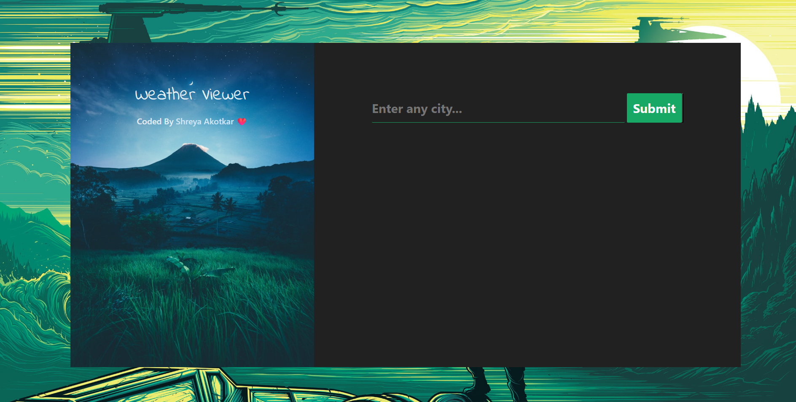

# 🌤 Weather App

A clean and responsive web application to check real-time weather updates by city name. Built using **HTML, CSS, and JavaScript**, with weather data fetched from the **OpenWeatherMap API**.

---

## 📸 Screenshot

## 🚀 Features
- Real-time weather updates
- Clean UI
- Responsive for desktop and mobile
- API integration with loading state

---

## 🔗 Live Demo
👉 [Click to View Live](https://shreya344.github.io/weather-dashboard/) 
---

## 📂 Tech Stack
- HTML5
- CSS3
- JavaScript (ES6)
- OpenWeatherMap API

---

## 👩‍💻 About Me
This is one of the frontend projects I created to showcase my skills in real-world scenarios.  
Check more on my GitHub: [github.com/shreya344](https://github.com/shreya344)
